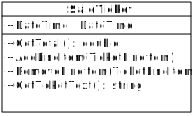
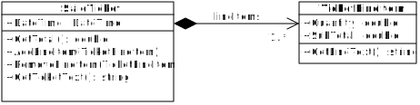
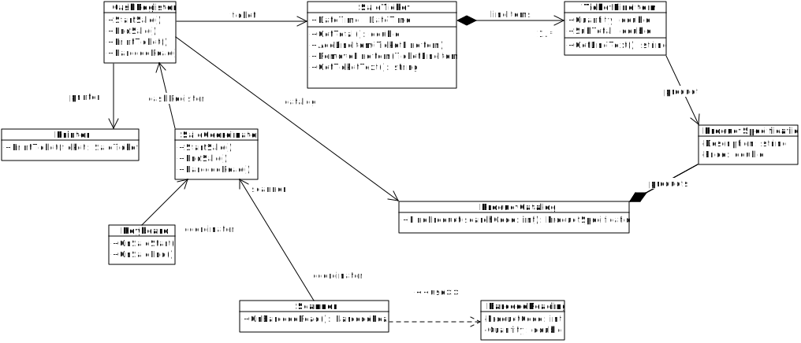
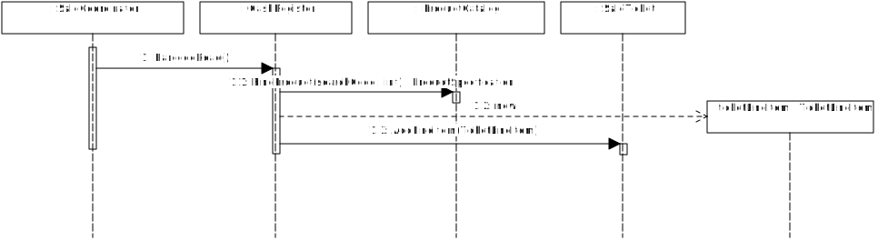

# Diagramas UML
## FIT - Universidad Católica del Uruguay

Ya vimos cómo utilizar las [tarjetas CRC](https://github.com/ucudal/PII_CRC_Cards) para representar las clases, sus responsabilidades y las colaboraciones que necesitan esas clases para poder implementar sus responsabilidades. Las tarjetas CRC son un buen recurso para comenzar a pensar en cómo distribuir las responsabilidades antes de programar código.

En este documento vamos a introducir otra herramienta para modelar clases, responsabilidades y colaboraciones: los diagramas [UML](https://www.uml.org/).

Aquí vamos a trabajar tres cosas:

* Cómo representar clases y relaciones entre clases en diagramas UML.

* Cómo representar el intercambio de mensajes entre objetos en diagramas de secuencia UML.

* Entender cómo queda en código C# lo que representamos en diagramas UML.

El escenario sobre el que vamos a trabajar es el mismo del punto de venta que presentamos ese documento de [tarjetas CRC](https://github.com/ucudal/PII_CRC_Cards). Recuerda el escenario:

> En una caja registradora hay un teclado con comandos para iniciar una nueva venta o terminar la venta en progreso, un escáner para leer el código de barra de los productos, y una impresora para imprimir un ticket. <br/><br/>El cajero oprime la tecla iniciar venta, y luego pasa uno a uno los productos por el escáner. La caja registradora va agregando líneas al ticket a medida que el escáner lee el código de barras en los productos. El código de barras que lee el escáner tiene el código del producto y la cantidad —en el caso de productos que se venden por peso, por ejemplo—. Cada línea del ticket incluye la cantidad, el producto y el precio. La caja registradora busca el precio del producto en el catálogo de productos, usando el código que leyó el escáner. Al final el cajero oprime la tecla terminar venta, la caja registradora calcula el total del ticket, y lo imprime en la impresora.

## Cómo representar las clases en diagramas UML a partir de las tarjetas CRC

### La clase `SaleTicket`

Comencemos por la clase `SaleTicket`. La tarjeta CRC es la que aparece a continuación:

<table id="card">
    <tr>
        <td align="center" colspan="2">
            <h3>SaleTicket</h3>
        </td>
    </tr>
    <tr>
        <td>
            <p>Conocer fecha y hora</p>
            <p>Conocer una o más líneas de ítems vendidos</p>
            <p>Proveer el texto a imprimir</p>
            <p>Calcular el total</p>
        </td>
        <td>
            <p>TicketLineItem</p>
        </td>
    </tr>
</table>

En un diagrama de clases UML lo representamos así:



El rectángulo representa la clase, y está dividido en tres partes:
* En la parte superior aparece el nombre de la clase, `SaleTicket`.
* En la parte del medio aparecen las responsabilidades de conocer, o **atributos** de la clase, por ejemplo, 'Conocer la fecha y hora' aparece como el atributo `+DateTime : DateTime`. A la izquierda de `:` está el nombre del atributo, a la derecha el tipo de dato del atributo; el símbolo `+` indica que el atributo es público. En los diagramas UML ya no usamos lenguaje natural, sino una representación más cercana a lo que vamos a implementar en C# después.
* En la parte inferior aparecen las responsabilidades de hacer, o **métodos** de la clase, por ejemplo, 'Calcular el total' aparece como `+GetTotal() : double`. A la izquierda de `:` está el nombre del método y sus parámetros entre paréntesis —en este caso no hay parámetros, entonces aparece `()`—, a la derecha el tipo de dato del resultado; nuevamente el símbolo `+` indica que el método es público.

### La relación entre las clases `SaleTicket` y `TicketLineItem`

La clase `SaleTicket` tiene la responsabilidad de 'Conocer una o más líneas de ítems vendidos'; sin embargo, no hay en el diagrama un atributo para representar eso. Esto ocurre porque en UML representamos las relaciones entre las clases de otra forma, mediante líneas que conectan los rectángulos con los que representamos esas clases.

En el diagrama UML conectamos la clase `SaleTicket` con la clase `TicketLineItem` mediante una línea, que tienen un rombo negro del lado de `SaleTicket` y una flecha apuntando a `TicketLineItem`:



El rombo negro indica que la clase `SaleTicket` contiene instancias de la clase `TicketLineItem`, y que las instancias de `TicketLineItem` no son compartidas con ninguna otra clase: una línea de un ticket es parte de un único ticket, no puede haber dos ticket con la misma línea. Esta relación se llama **composición** en UML.

La fecha que apunta de `SaleTicket` a `TicketLineItem` es para indicar que la primera clase conoce instancias de la segunda, pero no al revés, es decir, `TicketLineItem` no conoce la instancia de `SaleTicket` que lo contiene. Esto es porque `TicketLineItem` no necesita pedir ninguna colaboración a `SaleTicket`.

Por último, la notación `1..*` junto a `TicketLineItem` se llama **cardinalidad** y representa que una instancia de `SaleTicket` conoce una o más instancias de `TicketLineItem`: al menos una porque no sería razonable tener tickets sin líneas de ítems vendidos.

La tabla siguiente muestra la relación entre la tarjeta CRC de `SaleTicket` y el fragmento del diagrama UML que hemos visto hasta ahora:

| Responsabilidad en la tarjeta CRC | Elemento en el diagrama UML |
|---|---|
| Conocer fecha y hora | Atributo `DateTime : DateTime` |
| Conocer una o más líneas de ítems vendidos| Agregación con 1 o más instancias `TicketLineItem`|
| Proveer el texto a imprimir | Método `+GetTicketText() : string` |
| Calcular el total | Método `+GetTotal() : double` |

### La clase `CashRegister` y sus relaciones

A continuación la tarjeta CRC de la clase `CashRegister`:

<table id="card">
    <tr>
        <td align="center" colspan="2">
            <b>CashRegister</b>
        </td>
    </tr>
    <tr>
        <td>
            <p>Conocer la impresora</p>
            <p>Conocer el catálogo de productos</p>
            <p>Conocer el ticket de la venta en curso</p>
            <p>Iniciar una venta</p>
            <p>Terminar una venta</p>
            <p>Imprimir el ticket</p>
            <p>Recibir el aviso cuando se lee un código de barras</p>
        </td>
        <td>
            <p>SaleTicket</p>
            <p>TicketLineItem</p>
            <p>ProductCatalog</p>
            <p>Printer</p>
        </td>
    </tr>
</table>

Nuevamente muchas de las responsabilidades de conocer de la clase `CashRegister` se implementan mediante relaciones con otras clases en el diagrama UML. En este caso, esas relaciones son **asociaciones** y se representan con líneas. Nuevamente, la fecha indica que `CashRegister` conoce instancias de las demás clases, pero no al revés. Noten que en este caso no hay ningún número junto al final de la relación, esto es equivalente a poner `1..1`, que no aparece por simplicidad —se asume eso cuando no se pone cardinalidad—.


Las etiquetas que aparecen junto a las asociaciones representan el rol de la asociación.

La tabla a continuación muestra la correspondencia entre esta última tarjeta CRC y el fragmento del diagrama UML anterior:

| Responsabilidad en la tarjeta CRC | Elemento en el diagrama UML |
|---|---|
| Conocer la impresora | Asociación entre `CashRegister` y `Printer` |
| Conocer el catálogo de productos | Asociación entre `CashRegister` y `ProductCatalog` |
| Conocer el ticket de la venta en curso | Asociación entre `CashRegister` y `TicketLineItem` |
| Iniciar una venta | Método `+StartSale()` |
| Terminar una venta | Método `+EndSale()` |
| Imprimir el ticket | Método `+PrintTicket()` |
| Recibir el aviso cuando se lee un código de barras | Método `+BarcodeRead()` |

### El diagrama de clases completo

Ahora que hemos introducido los elementos básicos de la notación UML, deberías ser capaz de entender el diagrama completo:



### Diagramas de secuencia

Además de diagramas de clases, UML incluye otra notación para representar la interacción entre las clases en diagramas de secuencia, es decir, modelar los mensajes que se envía un objeto a otro. En este otro tipo de diagrama, los objetos están representados por rectángulos. Cada rectángulo tiene asociada una línea punteada vertical que representa el ciclo de vida de ese objeto. Los mensajes que se envían de un objeto a otro están representados por flechas horizontales, que incluyen la firma del mensaje.

Por ejemplo, para la responsabilidad de 'Recibir el aviso cuando se lee un código de barras' de la clase `CashRegister`, que se implementa en el método `+BarcodeRead()`, el diagrama de secuencia luce así:



Este diagrama se lee así:
* Una instancia de la clase `SaleCoordinator` envía el mensaje `BarcodeRead()` a una instancia de la clase `CashRegister`. Ese es el primer mensaje de la secuencia, por eso lleva el número `1`.
* La instancia de `CashRegister` que recibe ese mensaje, los procesa enviando el mensaje `FindProduct` a una instancia de `ProductCatalog`. Noten que ese mensaje retorna una instancia de `ProductSpecification`: esa es la forma que tiene `CashRegister` de averiguar cuál es el producto asociado a un código de producto leído por el escáner. Ese mensaje lleva el número `1.1`.
* Luego la instancia de `CashRegister` crea una instancia de `TicketLineItem`. Ese mensaje lleva el número `1.2`.
* Por último, la instancia de `CashRegister` agrega esa línea recién creada al ticket, enviándole a una instancia de `SaleTicket` el mensaje `AddLineItem`. Ese mensaje lleva el número `1.3`.

## Pasando de diagramas a código

Ahora vamos a ver cómo implementar en código lo que modelamos en diagramas UML. Veamos por ejemplo el fragmento del diagrama para la clase `SaleTicket`.


| Elemento en el diagrama UML | Miembro en la clase en C# |
|---|---|
| Atributo `+DateTime : DateTime` | Property `public DateTime DateTime` |
| Método `+GetTotal() : double` | Método `public double GetTotal()` |
| Método `+AddLineItem(TicketLineItem)` | Método `public void AddLineItem(TicketLineItem item)` |
| Método `+RemoveLineItem(TicketLineItem)` | Método `public void RemoveLineItem(TicketLineItem item)` |
| Método `+GetTicketText() : string` | Método `public string GetTicketText()` |
| Agregación con 1 o más instancias `TicketLineItem` | Variable de instancia privada `lineItems` de tipo `ArrayList` |

Fragmentos del código de la clase `SaleTicket` aparecen a continuación:

```csharp
public class SaleTicket
{
    private ArrayList lineItems = new ArrayList();

    public DateTime DateTime { get; set; }

    public double GetTotal()
    {
        •••
    }

    public void AddLineItem(TicketLineItem item)
    {
        •••
    }

    public void RemoveLineItem(TicketLineItem item)
    {
        •••
    }

    public string GetTicketText()
    {
        •••
    }
}
```
> [Ver en el repositorio »](./src/Library/SaleTicket.cs)
